<h1 style='display: flex; gap: 20%'>
     
    File Organizer
     
</h1>

Aplicación de escritorio para organizar tus archivos por extensión moviéndolos automáticamente los archivos llegue al directorio raíz

<h2>Índice</h2>

1. [Instalación](#id1)
    - 1.1. [Selección de idioma](#id1-6)
    - 1.2. [Configuración por defecto](#id1-1)
    - 1.3. [Configuración personalizada](#id1-2)
    - 1.4. [Creación de servicio de Windows](#id1-3)
    - 1.5. [Ejecución manual del aplicativo](#id1-4)
2. [Planteamiento del problema a resolver](#id2)
    - 2.1. [Tecnologias](#id1-7)

## Instalación

Para poder realizar la instalación es algo bastante sencillo, daremos doble click sobre el instalador [FolderOrganizer_Installer.exe](https://github.com/FrEaKAlL/FolderOrganizer/releases/tag/v1.0.0), el cual por medio de un wizard de instalación nos ira guiado poco a poco para realizar esto correctamente.

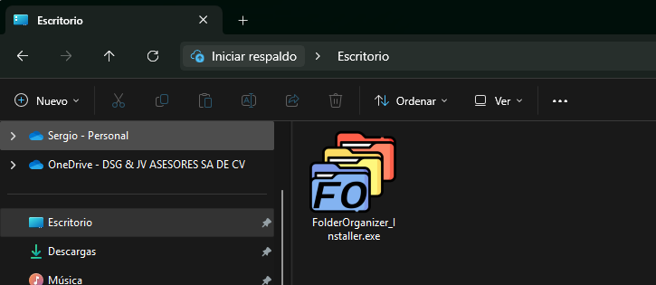

Una vez concluida la instalación el aplicativo no arranca por sí solo, debemos buscar dentro del menú de inicio o todas las aplicaciones.

> [!NOTE]
> Esto es debido a que el aplicativo requiere privilegios de administrador para la creación del servicio si así se configura.

Ya ubicado el aplicativo daremos doble click sobre este para abrirlo.

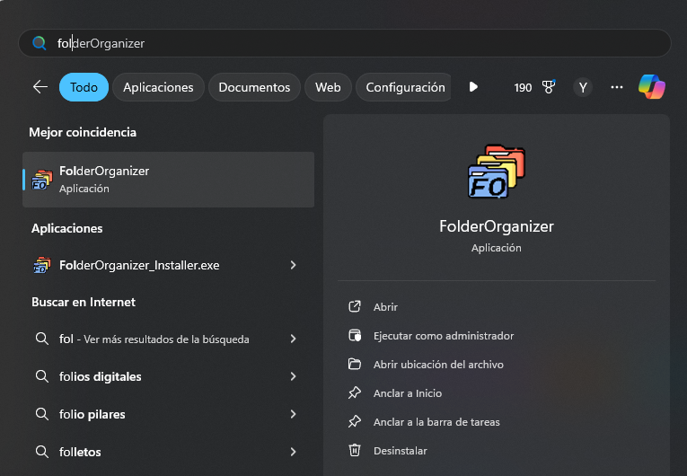

Como ya se mencionó este requiere privilegios de administrador así que aceptamos y se abrirá la siguiente consola.

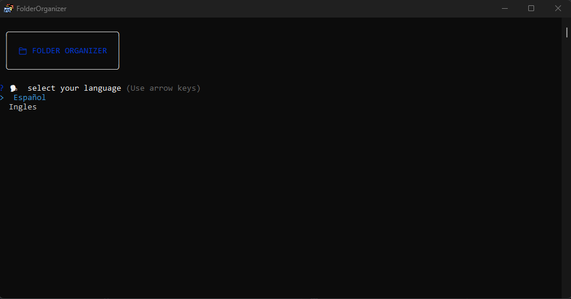

### Selección de idioma

Seleccionamos el idioma para poder realizar nuestra configuración sobre la carpeta a organizar.

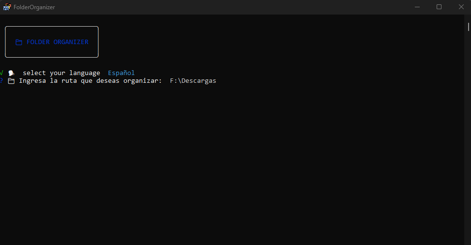

El sistema cuenta con una estructura de carpetas a organizar podemos seleccionar por defecto o personalizada.

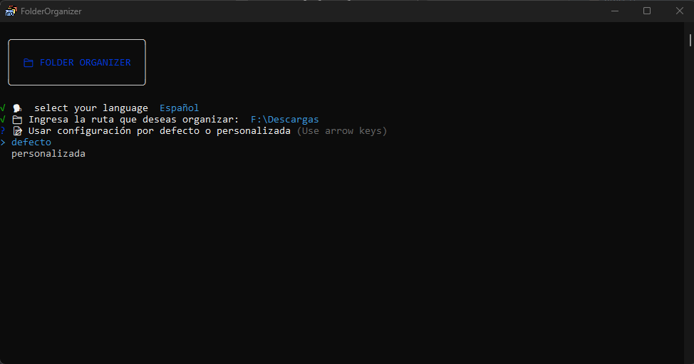

### Configuración por defecto

Si eliges por defecto este nos mostrara las carpetas que se tomaran en cuenta junto con las extensiones que considera el proceso.

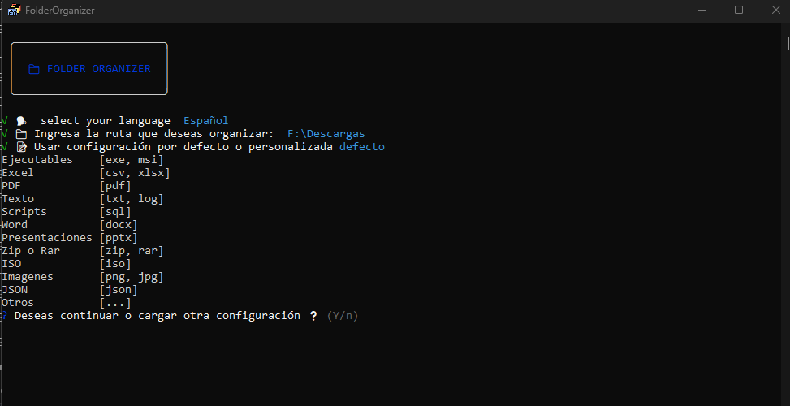

### Configuración personalizada

Si eliges personaliza este nos mostrara una serie de preguntas para las carpetas y extensiones que queremos considerar en el proceso de organización.

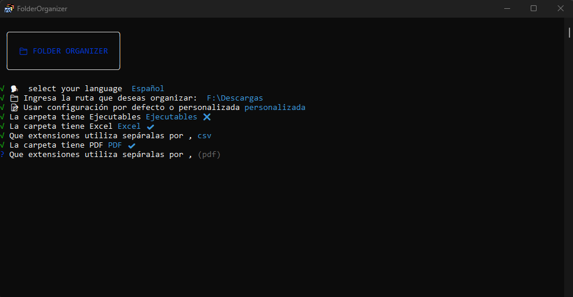

Una vez terminemos de elegir y configurar la opción deseada de organización el sistema nos cuestiona si es correcta la configuración o queremos modificarla, de ser correcto confirmamos, esto guardara la configuración.

### Creación de servicio de Windows

La creación del servicio es para automatizar el proceso y una vez llegue algún archivo a la carpeta raíz configurada el aplicativo lo mueva inmediatamente a su carpeta indicada.

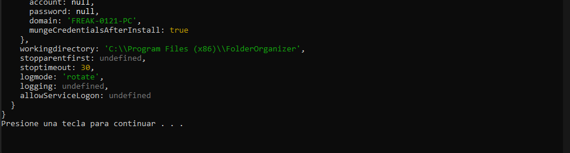

Una vez concluido el proceso de creación del servicio se nos mostrara el siguiente mensaje lo cual nos indica que se creo de forma correcta el servicio, simplemente damos click a cualquier tecla y el aplicativo se cerrar.

> [!NOTE]
> Se recomienda la creación del servicio para que nos desentendamos de estar ejecutando el aplicativo para estar organizado las carpetas, ya que este lo realizara en automático. 

Podemos validar la creación del servicio en el apartado de Servicios de Windows con el nombre de “FolderOrganizer”

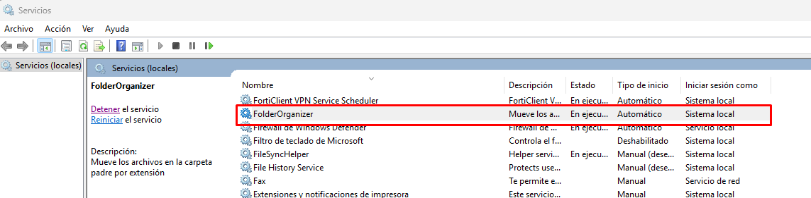

### Ejecución manual del aplicativo

Para la ejecución manual simplemente respondemos que no queremos crear el servicio y nos preguntara de inmediato si queremos ejecutar el aplicativo.

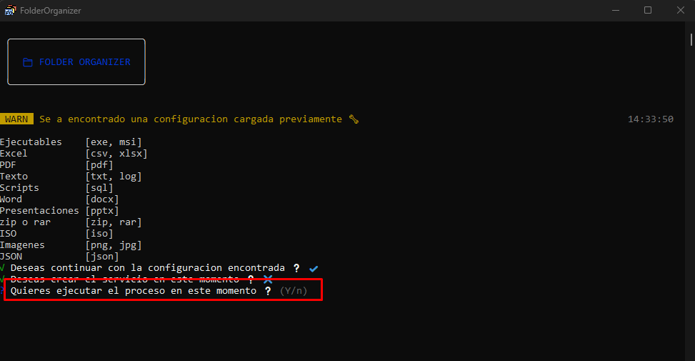

### Configuración previa

Si es la segunda vas que ejecutamos el aplicativo después de ya tener una configuración este nos preguntara si deseamos continuar con la configuración previa o cargar una nueva.

En caso de continuar con la configuración previa, nos realizara las últimas dos preguntas [Creación de servicio de Windows](#id1-3) o [Ejecución manual del aplicativo](#id1-4).

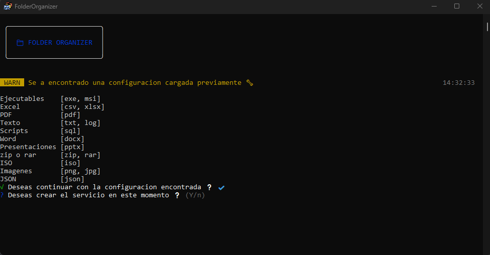

En el caso que se requiera cambiar la configuración respondemos n y continuamos a partir del punto anterior [Selección de idioma](#id1-6)

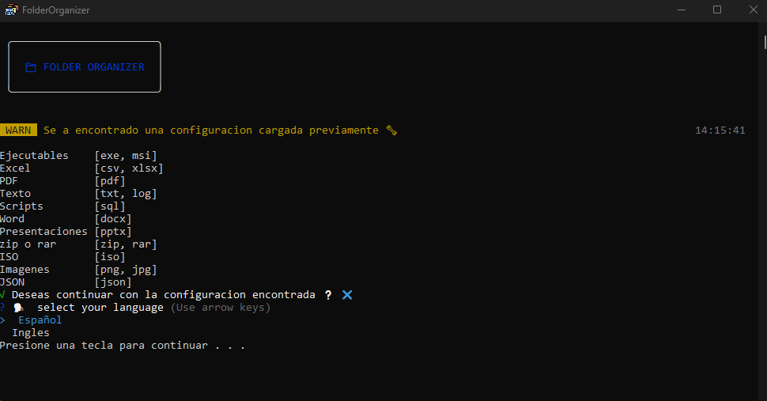

## Planteamiento del problema a resolver

Se presentaba una problemática al momento de descargar contenido de internet, chat, correos que estos quedaba en una sola carpeta lo cual en su momento llego a ser tardado el poder identificar los archivos que se tenían en uso o sobre los cuales se debería llevar un seguimiento.

Por esta razón se planteo el automatizar el proceso de identificación de los archivos para moverlo de forma automática a su respectiva carpeta, por medio del servicio, una vez se realizó la implementación y análisis de la solución se identifico que es posible que no se requiera en ocasiones un servicio por esto se creo un proceso de ejecución manual complementando el proyecto.

### Tecnologías

Para la creación del proyecto se utilizaron las siguientes tecnologías
* Node.js
* Eslint
* Consola
* Color
* Inquirer
* Node-windows
* Cross-env

Para la creación del instalador y exe
* Inno Setup Compiler
* bat-to-exe-converter
* inkscape para la creacion le icono

