<h1 align="center">
  
  <br>
  FolderOrganizer
</h1>

<p align="center">
  <strong>Keep your files organized automatically on Windows.</strong>
</p>

<p align="center">
  A lightweight, open-source application that automatically sorts your files using customizable rules.
</p>

<p align="center">
  <strong>🇺🇸 English</strong> |
  <a href="./README.es.md">🇲🇽 Español</a>
</p>

<p align="center">
  <a href="https://github.com/FrEaKAlL/FolderOrganizer/releases/latest"><strong>⬇ Download</strong></a>
  ·
  <a href="#-quick-installation"><strong>📖 Installation</strong></a>
  ·
  <a href="https://github.com/sponsors/FrEaKAlL"><strong>💖 Sponsor</strong></a>
</p>

<p align="center">
  
  
  
  
  <a href="https://github.com/sponsors/FrEaKAlL">
    
  </a>
</p>

---

## ✨ What is FolderOrganizer?

Files downloaded from the internet, chats, or email often end up accumulating in a single folder such as **Downloads**.

Over time, finding documents, images, installers, or other important files becomes increasingly difficult.

**FolderOrganizer** automates this task by monitoring the directory you configure and moving files into categorized folders according to their extensions and the rules you define.

It can run:

- 🔄 Automatically as a **Windows Service**.
- 💻 Manually whenever you want to organize your files.
- ⚙️ With a predefined folder structure.
- 🛠️ With custom rules.

------------------------------------------------------------------------

## 👀 Before and after

### Before

``` text
Downloads/
├── invoice.pdf
├── photo.jpg
├── video.mp4
├── report.xlsx
├── installer.exe
└── document.docx
```

### After

``` text
Downloads/
├── Documents/
│   ├── invoice.pdf
│   ├── report.xlsx
│   └── document.docx
├── Images/
│   └── photo.jpg
├── Videos/
│   └── video.mp4
└── Programs/
    └── installer.exe
```

> The final structure depends on the folders and rules configured by the user.

------------------------------------------------------------------------

## 🎬 Demo

<p align="center">
  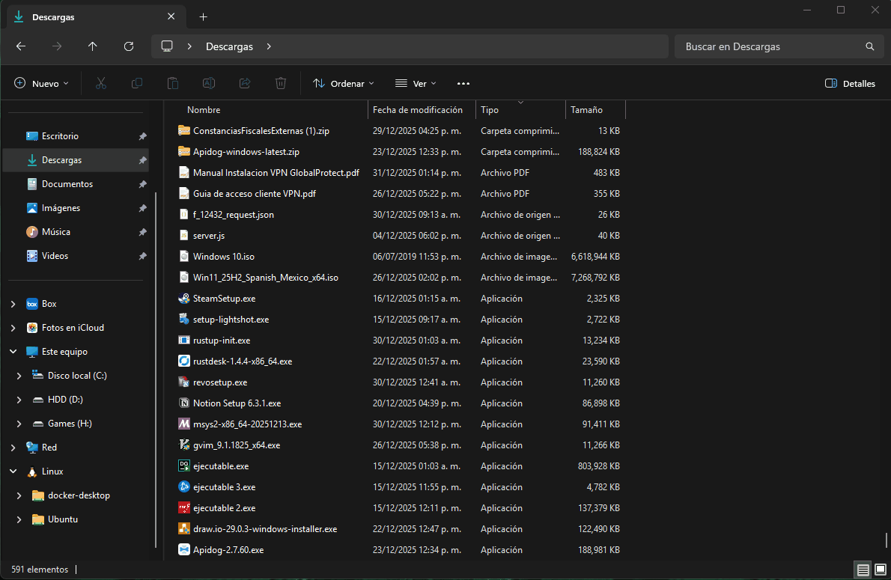
</p>

------------------------------------------------------------------------

## ⭐ Features

- 📁 Automatic file organization.
- ⚙️ Customizable rules.
- 🗂️ File classification by extension.
- 🔄 Automatic execution through a Windows Service.
- 💻 Manual execution whenever needed.
- 🧙 Interactive configuration wizard.
- 🗣️ Language selection.
- 💾 Reuse of previous configurations.
- 📦 Windows installer.
- 🔓 Open source.

------------------------------------------------------------------------

## 📥 Quick installation

The recommended way to install FolderOrganizer is by using the official installer available from GitHub Releases.

1.  Go to [**Releases**](https://github.com/FrEaKAlL/FolderOrganizer/releases/latest).
2.  Download `FolderOrganizer_Installer.exe`.
3.  Run the installer.
4.  Follow the installation wizard.
5.  Open **FolderOrganizer** from the Windows Start menu.

### [⬇ Download the latest version](https://github.com/FrEaKAlL/FolderOrganizer/releases/latest)

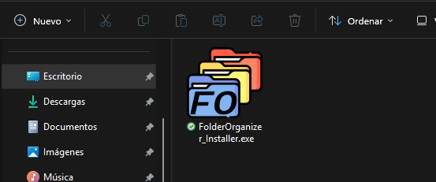

> [!NOTE]
> **Administrator permissions:** FolderOrganizer requires administrator privileges to register or manage the Windows Service when this option is used.

After installation, find **FolderOrganizer** in the Windows Start menu.

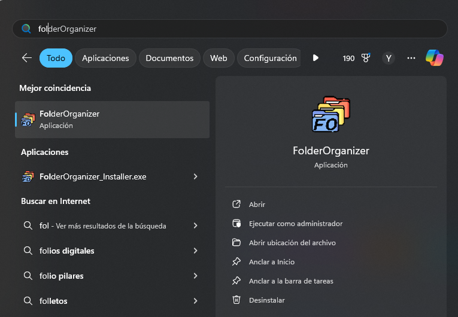

When you run the application, accept the Windows elevation request to open the interactive console.

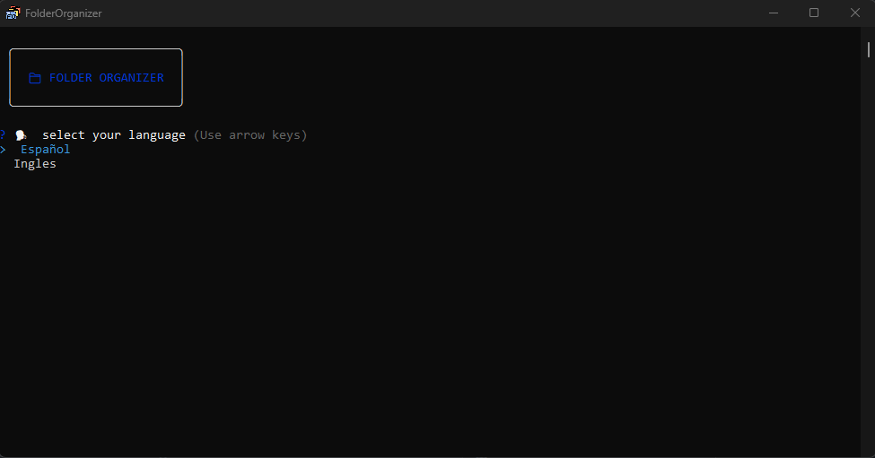

------------------------------------------------------------------------

## ⚙️ Configuration

FolderOrganizer includes an interactive wizard that lets you configure how your files should be organized.

### 🗣️ Language selection

Choose your preferred language for the configuration process.

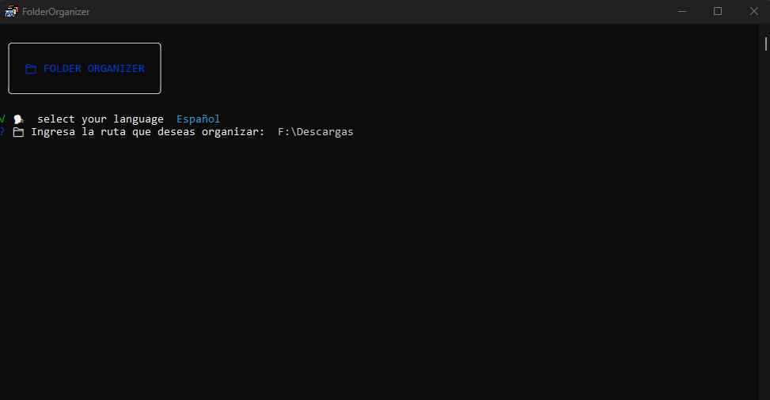

The application lets you choose between:

- **Default:** uses a predefined organization structure.
- **Custom:** lets you choose the folders and file extensions you want to use.

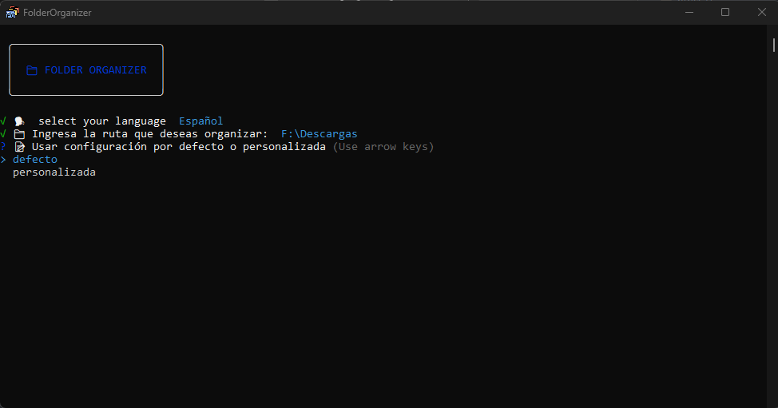

### 📁 Default configuration

The default configuration displays the standard folders that will be created along with the file extensions FolderOrganizer will use for automatic classification.

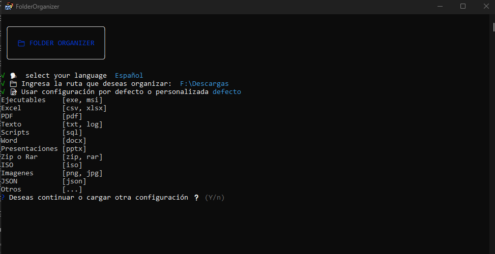

### 🛠️ Custom configuration

Custom configuration gives you greater control by allowing you to specify which folders and extensions should be included in the organization process.

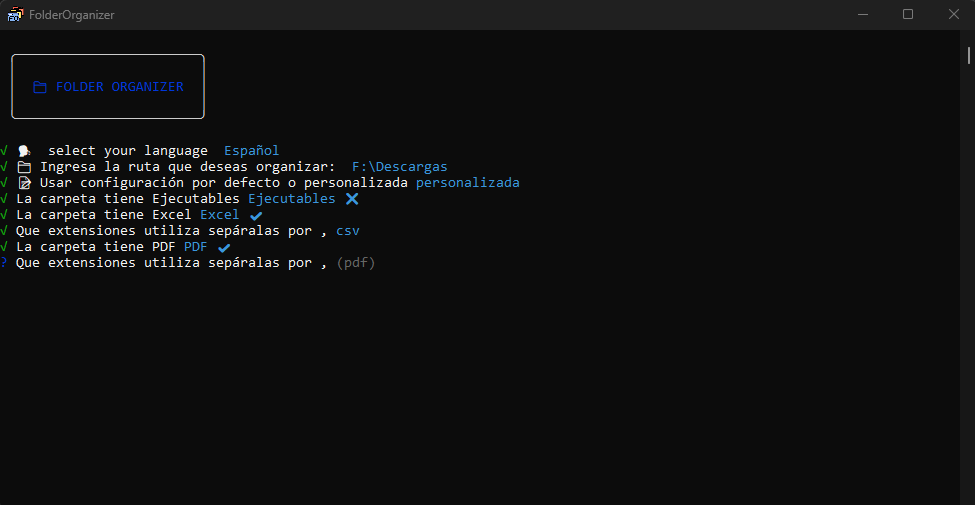

At the end of either configuration flow, FolderOrganizer asks you to confirm the settings before saving your preferences.

------------------------------------------------------------------------

## 🔄 Windows Service automation

The recommended way to use FolderOrganizer is through a **Windows Service**.

When the service is active, FolderOrganizer runs silently in the background and automatically organizes files that arrive in the configured directory.

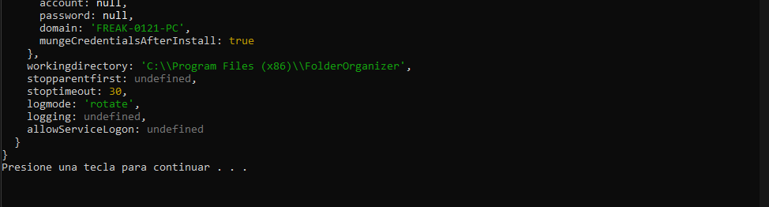

Once the service has been created successfully, the console displays a confirmation message.

> [!TIP]
> Using the Windows Service fully automates the process and removes the need to run FolderOrganizer manually.

You can verify the service status from the Windows **Services** management tool. The service is registered as:

``` text
FolderOrganizer
```

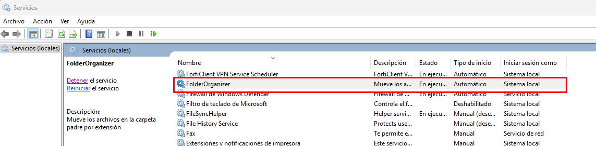

------------------------------------------------------------------------

## 💻 Manual execution

If you prefer not to install the Windows Service, FolderOrganizer can also be run manually.

During configuration, choose **not** to create the service. The application will ask whether you want to organize the files immediately.

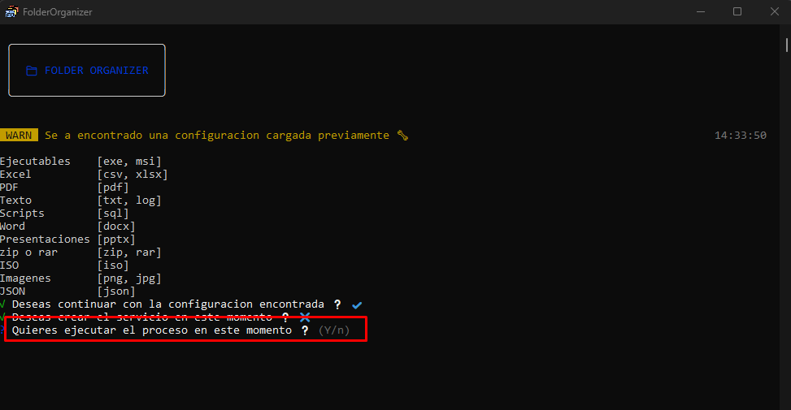

------------------------------------------------------------------------

## 📝 Previous configuration

From the second run onward, FolderOrganizer detects whether a previous configuration exists.

You can keep using the existing configuration or create a new one.

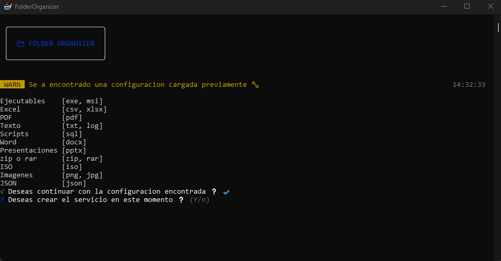

If you need to modify the organization rules, select `n` to start the wizard again.

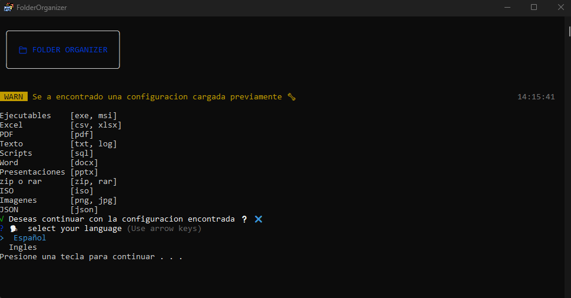

------------------------------------------------------------------------

## 👨‍💻 For developers

FolderOrganizer is open source. You can inspect the code, modify it, and build your own installer.

### 🔧 Build the installer

You will need:

- **Node.js**
- **Inno Setup 6**

From the project root, run:

``` powershell
pnpm run build:installer
```

The process prepares the application files in:

``` text
dist/FolderOrganizer-build
```

and generates the installer at:

``` text
dist/FolderOrganizer-Installer/FolderOrganizer_Installer.exe
```

If Inno Setup is installed in a custom directory, define `ISCC_PATH` before building:

``` powershell
$env:ISCC_PATH = 'C:\path\to\ISCC.exe'
pnpm run build:installer
```

------------------------------------------------------------------------

## 🛠️ Technologies

### Application logic and core

- **Node.js** — JavaScript runtime.
- **Inquirer** — interactive command-line configuration wizard.
- **node-windows** — Windows Service integration and installation.
- **Color** — visual formatting for the CLI.
- **ESLint** — code quality tooling.
- **cross-env** — environment variable management.

### Packaging

- **Inno Setup Compiler** — Windows installer generation.
- **bat-to-exe-converter** — utility used to package execution scripts.
- **Inkscape** — used to create the FolderOrganizer icon.

------------------------------------------------------------------------

## 🤝 Contributing

Contributions are welcome.

If you would like to report a bug, suggest a feature, or contribute code, please read our [contribution guide](./CONTRIBUTING.md).

You can also support the project by leaving a ⭐ on the repository.

------------------------------------------------------------------------

## 💖 Support the project

**FolderOrganizer** is an open-source tool developed and maintained independently.

If you find it useful and would like to support its maintenance and future development:

- ☕ [**Support me on Ko-fi**](https://ko-fi.com/FrEaKAlL)
- 💗 [**Become a GitHub Sponsor**](https://github.com/sponsors/FrEaKAlL)

Your support helps fund maintenance, bug fixes, documentation, and new features.

------------------------------------------------------------------------

## 📄 License

FolderOrganizer is distributed under the **MIT License**.

See [`LICENSE`](./LICENSE) for more information.

------------------------------------------------------------------------

Developed by [**FrEaKAlL**](https://github.com/FrEaKAlL).

If FolderOrganizer is useful to you, consider leaving a ⭐ on the repository.
